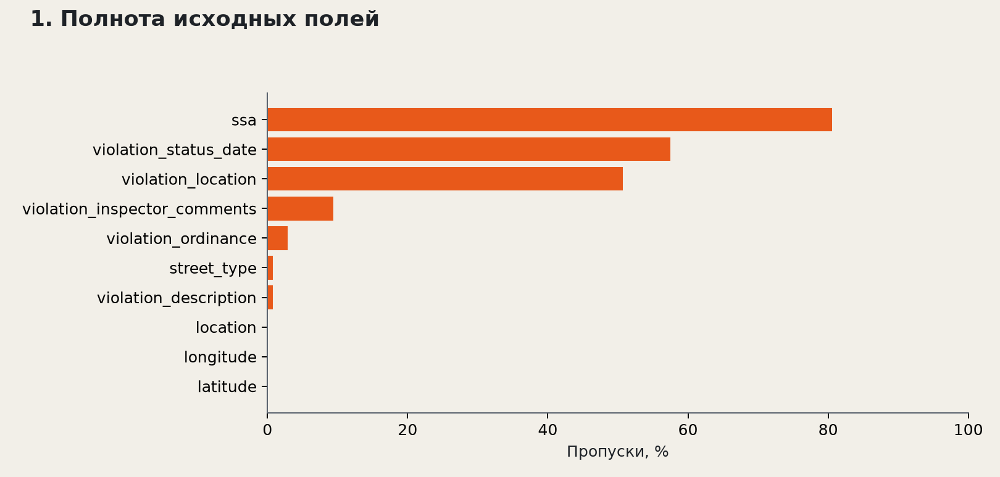
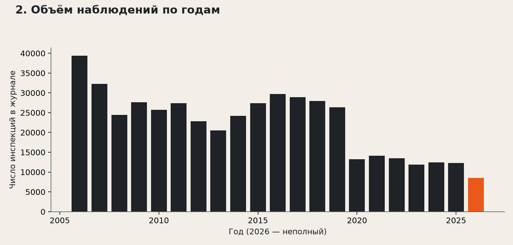
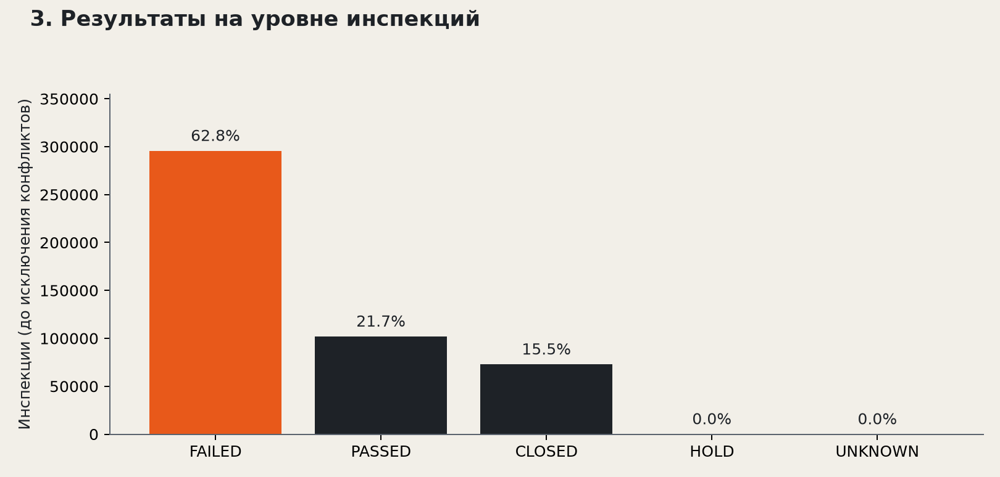
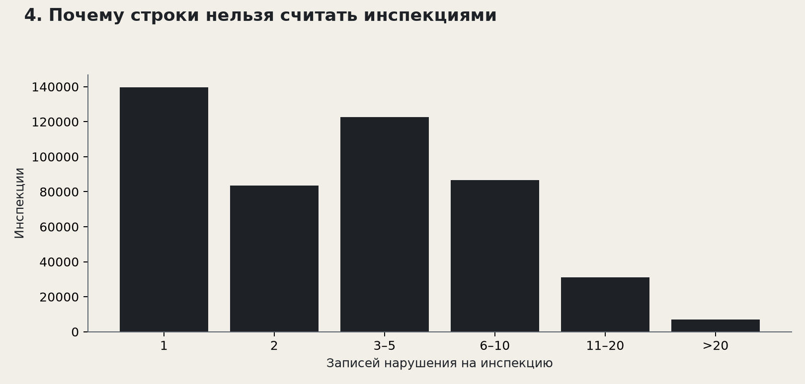
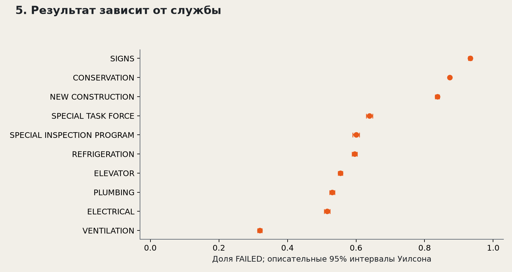
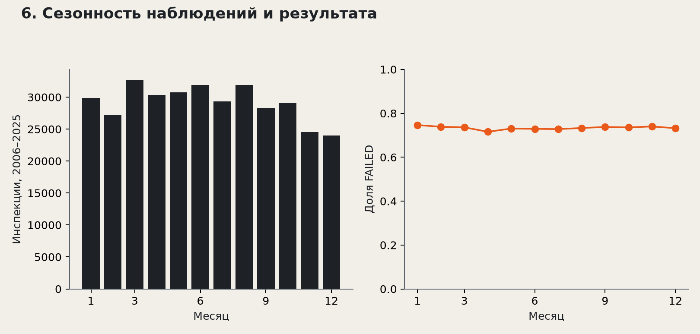
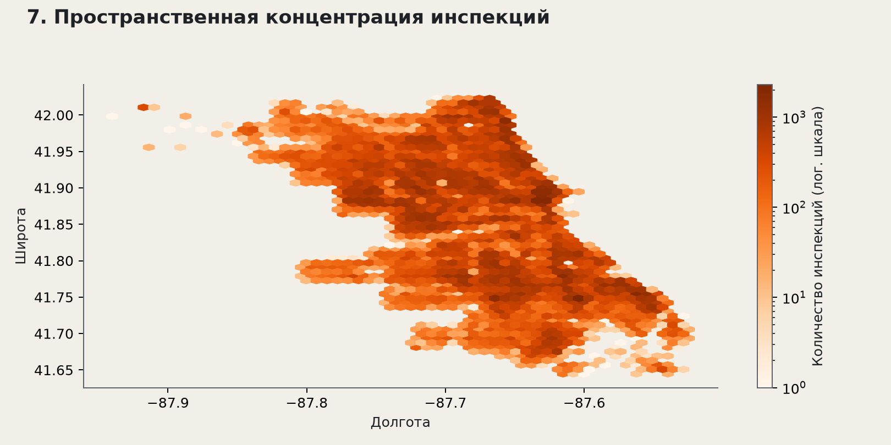
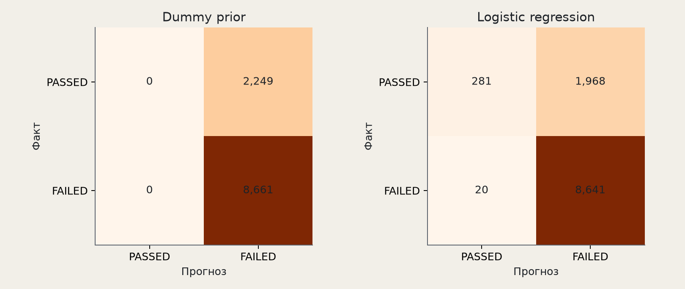

# Курсовой проект · первый рубежный контроль

## Анализ данных строительных инспекций для приоритизации контроля

Тема проекта: «Автоматизация строительного контроля и управления качеством СМР». Автор: Медиханов Тимур. Аналитическая часть самостоятельного учебного проекта. Связь с дипломом не заявляется.

Дата подготовки: 9 октября 2026 года. Источник: Chicago Building Violations, Chicago Data Portal, набор 22u3-xenr.

## Аннотация

Исследован полный доступный снимок из 2 032 070 записей нарушения и 26 полей. После объединения записей по номеру инспекции и отбора однозначных результатов получено 357 763 наблюдений для бинарной классификации. Проведены аудит качества по восьми пунктам, разведочный анализ с семью графиками и сравнение константной модели с логистической регрессией на временном тесте.

На 2025 годе Average Precision логистической модели составляет 0.928; у константной точки отсчёта — 0.794. Предварительный критерий успеха достигнут. Результат относится к зарегистрированным в архиве инспекциям и требует проверки на локальных данных перед практическим использованием.

## Состав сдаваемого результата

Постановка задачи; паспорт источника; восемь проверок качества; EDA с выводами; baseline; план дальнейшей работы и риски. Код, notebook, таблицы, графики и материалы размещены в репозитории. Разработка ERP-приложения и внедрение не входят в оценку этой работы.

# 1. Постановка задачи и критерий успеха

Пользователь результата — руководитель службы строительного контроля или координатор инспекций. Его решение — какие из уже запланированных проверок требуют более раннего внимания и дополнительной подготовки. Выход аналитики — вероятность FAILED и очередь приоритетов; решение о результатах самой проверки принимает инспектор.

Единица наблюдения — инспекция, определённая inspection_number. Цель — оценить P(FAILED | метаданные запланированной инспекции) среди наблюдений с однозначным FAILED или PASSED, представленных в журнале нарушений. Задача является бинарной классификацией с последующим ранжированием.

Предполагаемый момент прогноза — до осмотра. На входе: назначенная служба, категория проверки, календарная дата и известные координаты объекта. Их доступность в реальной системе пока не подтверждена. Текущий статус, список нарушений и результат устранения не используются.

| Ошибка | Практическое последствие | Учебная цена |
| --- | --- | --- |
| FN: FAILED предсказан как PASSED | Проблемная проверка получает низкий приоритет; задержка реакции и дополнительной подготовки. | 5 условных единиц |
| FP: PASSED предсказан как FAILED | Лишнее внимание и расход ограниченного времени специалиста. | 1 условная единица |

Соотношение 5:1 — учебная гипотеза, а не измеренный денежный ущерб и не экспертная оценка. Оно применяется одинаково к обеим моделям. Без подтверждения стоимости и доступной мощности проверок оптимальный порог нельзя считать операционным решением.

Предварительный критерий: на отложенном годе AP выше константного baseline минимум на 0.05, recall FAILED не ниже 0.80, precision не ниже доли FAILED на этом тесте. Порог выбирается только на validation по минимуму (5×FN+FP)/N. AP оценивает ранжирование, recall — пропуск проблемных проверок, precision — расход внимания.

# 2. Источник, формат и ограничения доступа

Первичный источник — Department of Buildings города Чикаго. Владелец публикует исторические записи нарушений с 2006 года; несколько нарушений могут относиться к одной инспекции. Данные носят информационный характер и могут не отражать текущее состояние здания [1].

| Параметр | Значение |
| --- | --- |
| Источник | data.cityofchicago.org · 22u3-xenr |
| Строк / полей | 2 032 070 / 26 |
| Период событий | 2006-01-01 — 2026-10-08 |
| Групп объектов / номеров инспекции | 155 788 / 470 576 |
| Различных кодов нарушения | 1 574 |
| CSV / Parquet ZSTD | 931.3 / 94.7 МБ |
| Скачано (Asia/Almaty) | 2026-10-09 16:48:53 |

Формат исходного экспорта — CSV UTF-8, 26 полей, даты представлены текстом. Для вычислений используется Parquet с явными типами и сжатием ZSTD. Открытый CSV экспорт скачан без учётной записи и без API-токена. Интернет требуется для получения нового снимка; после загрузки расчёты выполняются локально.

Ключевые поля: ID — запись нарушения; inspection_number — связь записей проверки; property_group — группа объектов; violation_date — дата события, используемая как приближение даты инспекции; inspection_status — наблюдаемый результат; department_bureau и inspection_category — организационный контекст; latitude/longitude — география.

Ограничения: источник изменяется; сервер может ограничить частоту запросов, а исторические статусы могут обновляться. Для повторения чисел сохранены SHA-256, время загрузки, метаданные и компактная таблица инспекций. Адреса и комментарии не нужны модели и не включены в компактную таблицу. Открытость источника не означает наличие подтверждённой свободной лицензии: новая лицензия на чужие данные не назначается.

# 3. Качество данных: пункты 1–4

Чек-лист преподавателя в предоставленном задании не раскрыт. Ниже применён стандартный аналитический чек-лист из восьми пунктов; это явное допущение проекта. Все количественные проверки выполнены на полном загруженном CSV, без подвыборки. Подробная машинная сводка — reports/quality.json.

| Проверка | Измеренный результат | Решение |
| --- | --- | --- |
| 1. Структура и типы | 26 полей; ошибки разбора дат: 0. | Явные типы, строгий CSV-парсер; потеря строк не допускается. |
| 2. Полнота | Без ключей: 0; без координат: 2 020. | Пропуски считаются по всем полям; координаты импутируются внутри train. |
| 3. Уникальность | Повторы ID: 0; полные повторы: 0. | ID нарушения и номер инспекции имеют разную гранулярность. |
| 4. Допустимые значения | Некорректных дат: 0; координат вне рамки: 0. | Даты 2006–09.10.2026; грубая рамка 41.6–42.1 / −88–−87.5. |

## Полнота и преобразование типов

Пропуском считается NULL или пустая строка после удаления крайних пробелов. Даты разбираются по явным форматам; неудачные преобразования отдельно проверяются против исходного текста. CSV читается в строгом режиме: ignore_errors не используется, поэтому ошибочные строки не могут исчезнуть незаметно.

Для признаков модели числовые пропуски заполняются медианой только обучающего периода, одновременно создаётся индикатор отсутствия значения. Категориальные пропуски обозначаются UNKNOWN. Пустые даты и ключи не имитируются искусственными значениями.

## Повторы и географические границы

Совпадение inspection_number ожидаемо: это связь нескольких нарушений одной проверки, а не дубликат строки. При повторе ID сохраняется запись с самой поздней датой изменения. Координаты вне грубой рамки Чикаго заменяются пропуском, а сама инспекция сохраняется. Рамка — проверка здравого смысла, а не официальный полигон административной границы.

# 3. Качество данных: пункты 5–8

| Проверка | Измеренный результат | Решение |
| --- | --- | --- |
| 5. Согласованность | Инспекций с разными датами: 41 744; обратных дат статуса: 0. | Проверка единства объекта, даты, службы, категории и статуса внутри инспекции. |
| 6. Целевая метка | Бинарная выборка: 357 763; FAILED: 73.7%. | FAILED=1, PASSED=0; остальные статусы и конфликты исключены. |
| 7. Репрезентативность | Один город; 155 788 групп объектов; 2026 неполный. | Архив нарушений не является полным реестром всех осмотров или СМР. |
| 8. Утечка и время | Train ≤2023; validation 2024; test 2025; 8 исходных признаков. | Постфактум поля исключены; версии полей на момент осмотра недоступны. |

Конфликт определяется как более одного непустого значения статуса, объекта, даты, службы или категории внутри inspection_number. Такие инспекции не используются для обучения: выбор первого или последнего значения без правила бизнес-процесса создавал бы произвольную разметку. Для EDA они сохранены с признаком ambiguous.

Все 41 744 исключения связаны с разными violation_date внутри одной инспекции; по статусу, объекту, службе и категории противоречий не обнаружено. Это неоднозначность приближения даты, а не доказанная ошибка источника. Консервативный отбор может сместить выборку: чувствительность к этому правилу нужно проверить после получения реальной даты осмотра.

FAILED и PASSED трактуются как наблюдаемые классы. CLOSED, HOLD и UNKNOWN не считаются успешной проверкой. Их число сохраняется в сводке, чтобы показать цену фильтрации. Условия отбора определены до обучения и одинаковы для всех периодов.

Репрезентативность ограничена механизмом попадания в журнал. Полные данные о зданиях без зарегистрированных нарушений и полный журнал всех инспекций отсутствуют. Поэтому нельзя оценить общий риск любого здания города или автоматически переносить частоты на стройплощадки Казахстана.

Утечка ограничена исключением текущих нарушений, комментариев, дат устранения, inspection_waived и результата проверки из признаков. Исторические target-агрегаты из прежнего notebook также исключены: последовательный порядок инспекций одного дня не подтверждает доступность их результатов. Остаточный риск — один современный снимок без версий полей на дату прогноза.

# 4. Подготовка данных и аналитический протокол

| Этап | Что выполняется | Выход |
| --- | --- | --- |
| raw | Загрузка полного CSV; хеш; метаданные; строгий разбор; типизированный Parquet. | CSV и manifest.json |
| processed | Нормализация строк; дедупликация ID; проверка дат; агрегация; поиск конфликтов. | inspections.parquet |
| model data | Отбор FAILED/PASSED без конфликтов; календарные признаки; сохранение полей для аудита. | model_data.parquet |
| analysis | 7 EDA-графиков; временное разделение; fit train; порог validation; оценка test. | JSON, CSV, PNG, SVG |

Из 2 032 070 строк сформировано 470 576 инспекций с корректным номером и датой. Для бинарной задачи осталось 357 763; исключено 112 813 из-за неоднозначного статуса или конфликтующих атрибутов. По каждой инспекции сохранено число исходных записей.

Дата инспекции приближена минимальной violation_date. Проверка единства даты внутри группы помогает обнаружить сомнительное соответствие, но не доказывает, что дата нарушения равна фактическому времени осмотра. Это ограничение должно быть снято полным реестром инспекций.

Поля n_violations и n_codes применяются в разведочном анализе, поскольку отражают структуру регистрации. Они отсутствуют в списке входов baseline: до текущего осмотра неизвестно, сколько нарушений будет найдено. Адрес, ID нарушения и инспектор тоже исключены из модели.

Код разделяет статистику по нарушениям и по инспекциям. Общие EDA-графики используют весь снимок; выбор порога и обучение никогда не используют test. EDA всего архива считается описанием данных, а не независимой проверкой гипотез.

# 5. EDA: полнота и временной охват

Максимальная доля пропусков — 80.6% в ssa. Даты статуса, комментарии и SSA не включены в модель; координаты заполняются медианой только по train с индикатором пропуска.

Максимум в архиве — 2006 год: 39,385 инспекций. 2026 год неполный и не используется как тест. Изменение объёма отражает и практику регистрации, поэтому не доказывает изменение качества зданий.

Аналитический вывод: большой размер архива не устраняет систематические пропуски и изменение процесса регистрации. Доля отсутствующих значений измеряется отдельно от аномальных диапазонов; неполный последний год не сравнивается с полными годами как равный по экспозиции.

# 5. EDA: метка и единица наблюдения

В бинарной выборке FAILED составляет 73.7%. CLOSED, HOLD и UNKNOWN исключены: отсутствие FAILED не означает PASSED. Accuracy без метрик классов может скрывать пропуски проблемных проверок.

Медиана — 3 записи, 95-й перцентиль — 13, максимум — 538. Доля FAILED по строкам перевзвешивает инспекции с большим числом нарушений. Число нарушений текущей проверки используется только в EDA.

Аналитический вывод: классифицировать следует инспекции, а не записи нарушения. Иначе сложные проверки получили бы больший вес, а записи одной проверки могли бы попасть одновременно в обучение и тест. Остальные статусы требуют отдельного исследования, а не автоматического превращения в отрицательный класс.

# 5. EDA: различия служб

Среди 10 крупнейших служб доля FAILED меняется от 31.9% до 93.3%. Служба — кандидат в признаки, но различие может отражать процедуры учёта. Интервалы описательные и не учитывают зависимость повторных инспекций одного объекта.

## Интерпретация организационного контекста

Сравниваются десять служб с наибольшим количеством наблюдений в бинарной выборке. На графике показаны доли FAILED и 95% интервалы Уилсона. Большие группы дают более узкий описательный интервал, но повторные проверки одного объекта нарушают независимость наблюдений.

Различия служб могут объясняться содержанием процедур, составом объектов и тем, какие результаты попадают в журнал. Почти постоянный класс у отдельной службы — повод проверить семантику учёта; это не доказательство высокого или низкого качества работы службы.

Служба и категория включены в простую модель как доступные метаданные. Следующая проверка — модель без этих полей, чтобы измерить, какая часть качества является следствием маршрутизации инспекций. Перенос между службами и городами должен оцениваться отдельно.

Таблица bureau_rates.csv содержит число инспекций и долю FAILED для каждого отображённого подразделения. Она позволяет проверить, что вывод не основан на редкой группе из нескольких событий.

# 5. EDA: сезонность и география

В полных годах месячная доля FAILED составляет 71.6%–74.7%. Месяц кодируется циклически; это ассоциация, смешанная с составом служб и лет, а не причинный эффект сезона.

У 502 инспекций нет пригодных координат. Карта показывает интенсивность наблюдения в архиве, без нормировки на число зданий. География может помочь ранжированию, но не позволяет объявить район более опасным.

Аналитический вывод: календарные и пространственные поля могут описывать состав и интенсивность проверок. Для оценки районного риска нужны внешние знаменатели: количество зданий, их возраст и полный реестр осмотров. В проекте причинные и территориальные выводы не заявляются.

# 6. Baseline: признаки, модели и разделение

| Выборка | Период | Инспекции | FAILED |
| --- | --- | --- | --- |
| train | 2006-01-01 — 2023-12-31 | 328 294 | 73.0% |
| validation | 2024-01-01 — 2024-12-31 | 10 594 | 76.9% |
| test | 2025-01-01 — 2025-12-31 | 10 910 | 79.4% |

Наблюдения 2026 года (7 965) не участвуют в оценке модели: год неполный. Разделение календарное, случайное перемешивание не применяется. Повторные объекты между train и test разрешены, поскольку предполагается работа на последующих проверках известного парка объектов.

Точка отсчёта — DummyClassifier(strategy="prior"). Она оценивает частоту FAILED по train и выдаёт одинаковую вероятность всем инспекциям; признаки не использует. Такая модель выявляет, насколько результат объясняется одной базовой частотой [2].

Вторая простая модель — логистическая регрессия с L2-регуляризацией (C=1, lbfgs, max_iter=2000). Два категориальных входа кодируются OneHotEncoder(handle_unknown="ignore"); шесть числовых входов заполняются медианой и стандартизуются. Преобразования обучаются в Pipeline только на train [3].

Входы: department_bureau, inspection_category, year, month_sin, month_cos, dayofweek, latitude, longitude. Циклическая пара sin/cos отражает близость декабря и января. Год описывает линейный тренд, поэтому экстраполяция на будущие годы — отдельный риск.

Для каждой модели перебирается порог от 0 до 1 с шагом 0.005 на 2024 годе. Выбирается минимум учебной стоимости 5×FN+FP; при равенстве берётся меньший порог. После этого модель и порог фиксируются и один раз оцениваются на 2025 годе. Модель не переобучается на validation.

# 6. Baseline: результаты на 2025 годе

| Модель | AP | ROC-AUC | Precision | Recall | Cost/N |
| --- | --- | --- | --- | --- | --- |
| Dummy prior | 0.794 | 0.500 | 0.794 | 1.000 | 0.206 |
| Logistic regression | 0.928 | 0.810 | 0.814 | 0.998 | 0.190 |

Матрицы ошибок: строки — факт, столбцы — прогноз; положительный класс FAILED.

Порог логистической модели — 0.235. На тесте: FN=20, FP=1 968, TP=8 641, TN=281. Balanced accuracy=0.561, F1=0.897, Brier=0.119. Предварительный критерий успеха достигнут; это оценка внутри доступного архива.

При данном пороге приоритет получают 97.2% тестовых инспекций; доля ложных тревог среди PASSED — 87.5%. Учебная стоимость ниже Dummy на 8.0%. Высокий recall достигнут широкой очередью, поэтому практическая экономия внимания пока не доказана.

AP здесь — average_precision_score, сумма precision, взвешенная приростами recall, а не трапецеидальная площадь PR-кривой [4]. ROC-AUC дополнительно характеризует ранжирование. Brier оценивает средний квадрат ошибки вероятности; меньше — лучше.

Доля объектов теста, встречавшихся в train: 66.9%. Такой тест соответствует следующим проверкам существующего парка, но не подтверждает перенос на новые объекты. Для него нужна дополнительная оценка по группам property_group.

# 7. План дальнейшей работы и риски

| Этап после РК-1 | Результат | Критерий завершения |
| --- | --- | --- |
| Недели 8–9 | Проверить семантику FAILED/PASSED, даты и доступность метаданных. | Словарь полей и подтверждённый момент прогноза. |
| Недели 10–11 | Получить полный реестр инспекций и локальную выборку СМР. | Есть проверки без нарушений и однозначная разметка. |
| Недели 12–13 | Rolling backtest; тест новых объектов; абляция служб; калибровка. | Стабильные метрики по периодам и подгруппам. |
| Недели 14–15 | Проверить стоимость ошибок и лимит очереди; сравнить простое дерево. | Порог и precision@K согласованы с пользователем. |

| Риск | Значимость | Способ уменьшить |
| --- | --- | --- |
| Смещение журнала нарушений | Высокая | Получить полный знаменатель инспекций; ограничить выводы до этого. |
| Чикаго ≠ локальный контроль СМР | Высокая | Независимая локальная оценка; не переносить готовый порог. |
| Обновление исторических статусов | Высокая | Версии событий и данные на момент принятия решения. |
| Дрейф служб и категорий | Средняя | Оценка по годам и службам; мониторинг частот. |
| Неизвестная цена ошибки | Средняя | Экспертное согласование, анализ 1:1 / 3:1 / 5:1 / 10:1. |
| Повторы объектов и редкие группы | Средняя | Групповые оценки; интервалы с учётом кластеров. |

В рамках предмета дальнейшие шаги остаются аналитическими: уточнение данных, качества, постановки и простой модели. Разработка приложения, интеграция с ERP и внедрение — отдельные будущие работы проекта, не часть текущей сдачи.

# 8. Воспроизводимость, выводы и источники

Полный запуск: создать Python-окружение, установить requirements.txt, выполнить python -m src.pipeline и python -m src.artifacts. Интерактивный вариант — notebooks/course_project.ipynb. Для повторения baseline на зафиксированном снимке интернет не требуется: компактные inspections.parquet и model_data.parquet включены в репозиторий.

Исходный CSV и raw Parquet велики и исключены из Git; код скачивает их из первоисточника. Повторная загрузка живого архива может дать другие числа. SHA-256 фиксирует идентичность исходного файла, но не гарантирует его вечную доступность на сервере. Версии использованных библиотек сохранены в requirements.txt и reports/environment.json.

SHA-256 исходного CSV: fd1c8de7cc2638a0464a190b65eb0461a829094f13742b080fecc50b4ff5fb42

Старые замеры производительности от 26.09.2026 сохранены отдельно как историческое приложение: CSV 930.39 МБ, Parquet Snappy 149.29 МБ; чтение 15.25 и 1.581 секунды. Они относятся к иной машине и прежнему снимку, не выдаются за повторные замеры в этом отчёте. При выбранном масштабе Parquet и DuckDB подходят для локального аудита и агрегации, pandas — для таблицы инспекций.

## Выводы

Аналитическая задача сформулирована условно на охват источника; качество проверено, а гранулярность исправлена до уровня инспекции. Семь EDA-графиков показывают пропуски, временной охват, баланс метки, множественность нарушений, службы, сезон и географию. Простая модель улучшает AP на 0.135 относительно частотной точки отсчёта. Практическая переносимость остаётся открытой до получения локальных данных и истории версий.

## Источники (проверены 09.10.2026)

[1] Chicago Data Portal. Building Violations. https://data.cityofchicago.org/Buildings/Building-Violations/22u3-xenr ; метаданные: data/raw/source_metadata.json.

[2] scikit-learn. DummyClassifier. https://scikit-learn.org/stable/modules/generated/sklearn.dummy.DummyClassifier.html

[3] scikit-learn. Common pitfalls: leakage and preprocessing. https://scikit-learn.org/stable/common_pitfalls.html

[4] scikit-learn. average_precision_score. https://scikit-learn.org/stable/modules/generated/sklearn.metrics.average_precision_score.html
